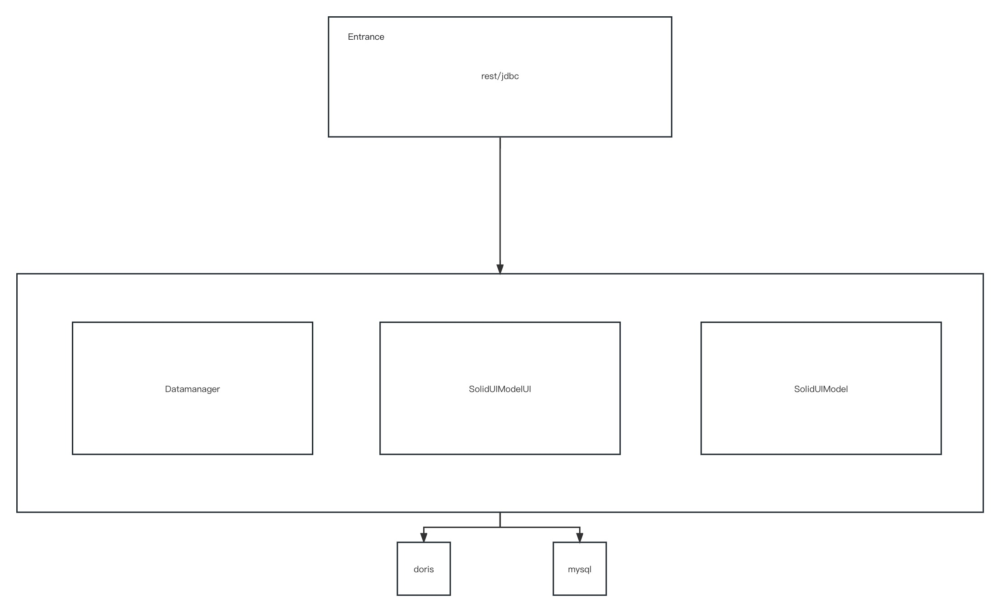

SolidUI Service Architecture
-------------------------

## 1. Architecture Overview

Entrance: API interface layer, mainly responsible for the request of the front-end UI layer, the service uniformly provides RESTful api to provide request services to the outside

## 2. Module function

* solidui-bom: BOM (Bill of Materials) is usually used to manage dependency versions in a project to ensure that all modules use the same version of dependencies.

* Solidui-common: This module contains common code and tools used throughout the project.

* Solidui-dao: DAO (Data Access Object) module contains all the codes to interact with the database.

* solidui-datasource-plugin: This module provides a way to extend the data source, so that data can be obtained from many different types of data sources.

* solidui-dist: The build and distribution of this module project.

* Solidui-entrance: This module is the main entry point of the project and contains the code to start and initialize the application.

* Solidui-service: This module contains business logic code.

* Solidui-spi: The SPI (Service Provider Interface) module provides a way to extend the functionality of the project.

* solidui-web: This module contains the front-end code for displaying user interface, chat interface.

* soliduimodelui: module model proxy layer, used to upgrade the data model conversion of the UI layer.

## 3. Source code explanation

### 3.1 solidui-bom

This is a Maven project object model (POM) file, which is an XML-based project configuration file used to describe information about building a project, such as project dependencies, build plugins, project properties, etc.

This POM file defines a project named solidui-bom whose parent project is solidui.

In this POM file, there are three main parts:

* Properties: Defines the version numbers of various dependent libraries. This is a common way to manage versions of all dependent libraries in a project, defining and updating all dependent versions in one place.

* Parent: Defines the parent project of this project. In Maven, you can inherit some common configurations, such as dependency management, plug-in management, etc., by defining a parent project.

* Dependency Management: This section defines the project's dependent libraries and their versions. All dependencies defined here can be used directly in submodules without specifying a version number. If a dependency in a submodule conflicts with a dependency here, the version defined here will take precedence.

According to this POM file, you can know which libraries this project depends on and the versions of these libraries. In addition, if you need to add a new dependency library, or update the version of an existing dependency library, you can also do it in this file.

### 3.2 solidui-common

Constants: This class defines some global constants that may be used throughout the project. For example, the key name of the HTTP header, the encryption key, etc.

DateConstants: This class defines formatted string constants for datetimes.

ByteTimeUtils: This class currently looks empty, it may be a utility class for handling bytes and time.

DESUtil: This class provides encryption and decryption methods based on the DES algorithm for secure data transmission.

EncryptionUtils: This class provides a method to calculate the MD5 value of a string.

JSONUtils: This class provides a series of JSON processing methods, including serialization of objects to JSON, deserialization of JSON to objects, conversion of JSON to List or Map, etc.

LoginUtils: This class provides some methods for handling login users, such as setting login users, removing login users and getting login users.

Utils: This class provides some common utility methods, such as creating a thread factory with a custom thread name and daemon state, and creating a default scheduled task executor.

### 3.3 solidui-dao

This module is called solidui-dao, and mainly includes configuration and object models related to the data access layer.

SpringConnectionFactory: This configuration class is mainly used to configure MyBatisPlus related settings, such as paging plug-ins, transaction managers, SqlSessionFactory, etc.

DataSource, DataSourceType, DataSourceTypeKey, JobElement, JobElementPage, JobPage, ModelType, Project, User: These classes are entity classes that represent the data structure of each table in the database.

DataSourceMapper, DataSourceParamKeyMapper, DataSourceTypeMapper, JobElementMapper, JobElementPageMapper, JobPageMapper, ModelTypeMapper, ProjectMapper, UserMapper: These interfaces are Mapper interfaces of MyBatis, which are used to define CRUD operations for corresponding tables.

PageListingResult: This is a wrapper class for wrapping the results of paging queries.

DaoConfiguration: This is a Spring configuration class used to start Spring Boot's automatic configuration and scan the Mapper interface.

Through this module, you can easily operate the database. For example, you can query a user given a username and password through the queryUserByNamePassword method of UserMapper. All Mapper interfaces inherit from the BaseMapper interface of MyBatisPlus, so they all have basic CRUD operations.

### 3.4 solidui-datasource-plugin

This module is called solidui-datasource-plugin and contains configuration and object models related to datasource plugins.

DorisClient: This class inherits from BaseJdbcClient and implements specific methods for interacting with the Doris database, including obtaining all databases, obtaining all tables of the database, and executing query statements and obtaining results.

DorisClientFactory: This class inherits from BaseJdbcClientFactory and implements the factory method for creating DorisClient.

DorisConnectionFactory: This class implements the ConnectionFactory interface and provides a method for creating a connection to the Doris database.

MysqlClient: This class inherits from BaseJdbcClient and implements specific methods for interacting with the MySQL database, including obtaining all databases, obtaining all tables of the database, and executing query statements and obtaining results.

MysqlClientFactory: This class inherits from BaseJdbcClientFactory and implements the factory method for creating MysqlClient.

MysqlConnectionFactory: This class implements the ConnectionFactory interface and provides methods for creating connections to MySQL databases.

JdbcClientManager: This class is used to load the configured ConnectionFactory.

ConnectDTO: This class is a simple data transfer object that contains the information needed to connect to the database, such as hostname, port, username, password, database name, and additional parameters.

Other interfaces such as JdbcClient, JdbcClientFactory, ConnectionFactory, etc. define some common methods, and specific implementation classes such as DorisClient, DorisClientFactory, DorisConnectionFactory, etc. provide the specific implementation of these methods.

In addition, the pom.xml file of this module configures the solidui-datasource-all submodule, which depends on two modules, solidui-datasource-mysql and solidui-datasource-doris, which define how to communicate with MySQL and Doris Database interaction.

### 3.5 solidui-dist

This module is called solidui-dist, and it is mainly responsible for the release and deployment of the project.

docker-compose.yml: This is a Docker Compose configuration file for defining and running multi-container Docker applications. In this file, several services are defined: solidui-entrance, solidui-web, mysql and soliduimodelui. These services will be run as containers by Docker.

release-docs: This folder may contain release documents such as LICENSE and NOTICE.

assembly.xml: This is the configuration file for the Maven Assembly plugin, which defines how to create the project's release package. In this file, it is defined which files and folders need to be included.

The role of this module is mainly to define how to package the project and how to deploy the project. With Docker Compose, it is very convenient to deploy and run this project on any machine with Docker installed. Through the Maven Assembly plug-in, it is very convenient to create the release package of the project, which contains all the files needed to run the project.

### 3.6 solidui-entrance

This module is named solidui-entrance. As the entry point of the application, it provides multiple controllers (Controller) for processing user requests.

BaseController: Provides some common methods for returning results, including successful results and error results.

DataSourceController: Provides a series of APIs related to data sources, such as obtaining all data source types, obtaining parameter keys according to types, querying databases according to data source names and types, etc.

JobController: Provides some job-related APIs, such as saving pages, updating jobs, querying jobs by project ID, etc.

JobPageController: Provides some APIs related to job pages, such as creating job pages, updating job pages, querying job pages by project ID, etc.

LoginController: Provides login and logout APIs.

MetadataQueryController: Provides some APIs related to metadata query, such as querying database by data source name, querying table by data source name, querying by SQL, etc.

ModelController: Provides an API to get a list of models.

ProjectController: Provides some project-related APIs, such as creating projects, updating projects, querying projects by project name, deleting projects, etc.

Each Controller depends on the corresponding Service, and the corresponding business logic is defined in the Service. For example, DataSourceController depends on DataSourceService, which defines business logic such as how to query all data source types and how to obtain parameter keys according to types.

In addition, some Service implementation classes are provided, such as DataSourceServiceImpl, DataSourceTypeServiceImpl, JobPageServiceImpl, JobServiceImpl, MetadataQueryServiceImpl, ModelServiceImpl, ProjectServiceImpl, and UserServiceImpl. These classes implement the corresponding Service interface and provide specific business logic.

In general, this module mainly processes user requests, executes corresponding business logic, and returns results.

### 3.7 solidui-service

Contains some service layer code.

### 3.8 solidui-spi

ConnectDTO: This is a simple data transfer object that contains the information needed to connect to the database.

ConstantsSPI: This class defines some constants that may be used in SPI (Service Provider Interface).

### 3.9 solidui-web

This is a front-end project based on React and Ant Design. The main contents of the project include:

- The main application entry `index.tsx`, used to initialize and render the entire application.
- `App` component, which is the main component of the application, is used to define routes and render corresponding components.
- `routes` defines all the routes of the application, including home page, login page, project list page, data source list page, dashboard page and preview page, etc.
- The `DefaultLayout` component defines the main layout of the application, including the header, sidebar, and main content area.
- Two components `ProjectList` and `DataSourceList` are used to display project list and data source list respectively.
- The `Dashboard` component is used to display dashboards and display data visualization results.
- The `Login` component is used to handle user login logic.
- The `Home` component defines the home page content of the application.
- Two custom Hooks `useProject` and `useDataSource` are used to handle business logic related to projects and data sources.
- `ModelManager` class, used to manage the state of the application.
- `ViewFactory` class, used to create views.
- The `SolidView` class defines an abstract view base class, and all view components need to inherit from this base class.

In addition, the project also includes some auxiliary modules, such as `ApiService` is used to encapsulate API requests, `theme` is used to define theme styles, `solidui-entrance` and `solidui-web` are the main components of the backend and frontend respectively Modules, `api` and `service` define some API interfaces and services, and `components` contains some public components.

The project uses some third-party libraries, such as `axios` for processing HTTP requests, `lodash-es` for providing some useful utility functions, `antd` is a UI component library based on React, `echarts` for data Visualization, `react-router-dom` for handling routing, `react-window` for optimizing rendering performance of long lists, etc.

The construction tool of the project is `webpack`, which uses `babel` to translate JavaScript code, `eslint` and `prettier` for code specification and formatting, and `jest` for unit testing. In addition, the project also uses `husky` and `lint-staged` to automatically check and fix code issues before committing code.

### 3.10 soliduimodelui

This is a backend project based on Flask and MySQL, which is mainly used to process requests from the frontend and perform corresponding operations. The main functional modules include:

* kernel_manager: This module is mainly responsible for managing and operating the Python kernel, and processing code execution requests from the front end. The kernel manager implements communication with the Python kernel, receives and processes the output of the kernel, and handles various states of the kernel. In addition, it also provides a message queue for receiving and sending kernel messages.

* kernel_program: This module is mainly responsible for starting and managing the subprocesses of the Python kernel. It starts the Python kernel through a subprocess, and then communicates with the kernel through the SnakeMQ message queue.

* utils: This module provides some useful utility functions, such as sending JSON messages, initializing SnakeMQ message queues, etc.

* webapp: This is a Flask-based web application that provides a series of APIs for front-end calls, such as executing code, obtaining execution results, and managing the Python kernel. This application uses CORS middleware to handle cross-origin requests.

* web_utils: This module provides some common utility functions in Web applications, such as formatting response data, querying databases, etc.

* .env: This is an environment variable configuration file, which contains configuration information such as database connection information and application port number.

The operation process of the project is roughly as follows:

1. Start the Flask web application and provide an API interface for front-end calls;
2. The front end initiates a request, such as executing code, etc.;
3. The web application receives the request and calls the kernel manager to perform corresponding operations;
4. The kernel manager communicates with the Python kernel through the SnakeMQ message queue, executes the code and obtains the result;
5. The web application returns the execution result to the front end.

In addition, the project also provides some auxiliary functions, such as log output, error handling, etc.