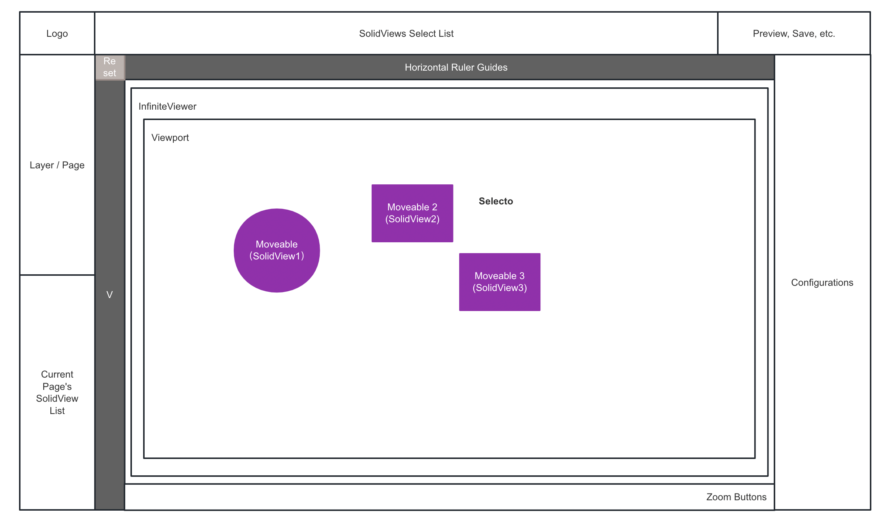
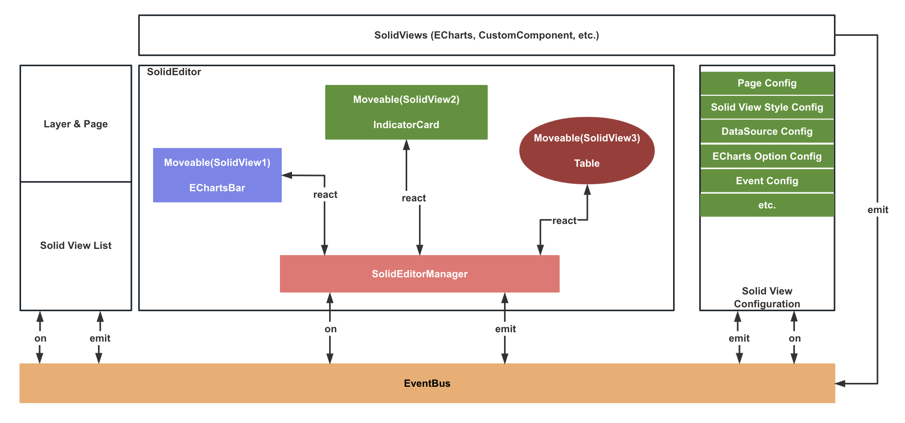
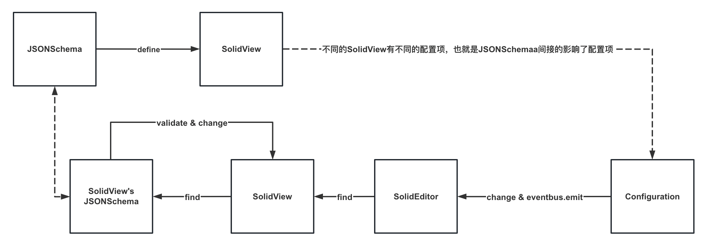

SolidUI Frontend Design
-------------------------

### 1. SolidUI Module

1. The designer is divided into five areas. includes Layer/Page, SolidView List, SolidEditor, Configuration, SolidView Select List.

2. Layer/Page：The Layer is mainly to configure the scene, and the Page is to configure and design its own components.

3. SolidView List：It is convenient to select the components to be configured, and perform management operations such as deleting and locking the components.

4. SolidEditor：As a highly cohesive component, it can subscribe and publish events externally through EventBus. Inside the component, RulerGuides, InfiniteView, Moveable, Selecto, and Viewport are used to complete the interaction and operation logic of the entire editing area.

5. Configuration：Configure the WYSIWYG style, data source, event interaction, etc. for the selected SolidView.

6. SolidView Select List：Provides a button area at the top for selecting and placing individual components.

### 2. 总览架构

### 3. SolidEditor & Preview（WISYWI）

1. SolidEditor integrates RulerGuides (rulers, auxiliary lines), InfiniteView (infinite scrolling view in the editing area), Viewport (visible area), Moveable (basic capabilities such as drag and drop, size, rounded corners, alignment, and marking lines), Selecto (multiple selection, combination).

2. SolidView is a reusable base class component. We hope to display various SolidViews through a well-designed JSONSchema and its specific JSON content, that is, SolidView should only be bound to the JSONSchema data model and injected into EventBus to complete Interaction between different SolidViews. But when we are editing the design, we need to wrap SolidView to achieve the design capabilities in the designer mode. So we need to wrap SolidView in edit mode to get a ProxyView.

3. When we preview the designed page, our SolidShowEngine will load the designed JSONSchema specific data model to complete the final rendering.

### 4. SolidView & JSONSchema & Configuration

1. Design JSONSchema to define what a SolidView component should look like, and different SolidView components may extend JSONSchema. The advantage of this is that we abstract SolidView into a JSON description document, which can focus on JSONSchema, and discuss the feasibility of each modification for JSONSchema.

2. On the basis of JSONSchema, plan the configuration capabilities of the Configuration module. Including UI display, component development required by UI, etc.

3. Interaction process: select a component -> modify the configuration item -> send a modification event -> SolidEditor receives the subscribed event message -> find the target SolidView -> find the corresponding JSONSchem -> verify and save the modification -> SolidView for this configuration modify in response.