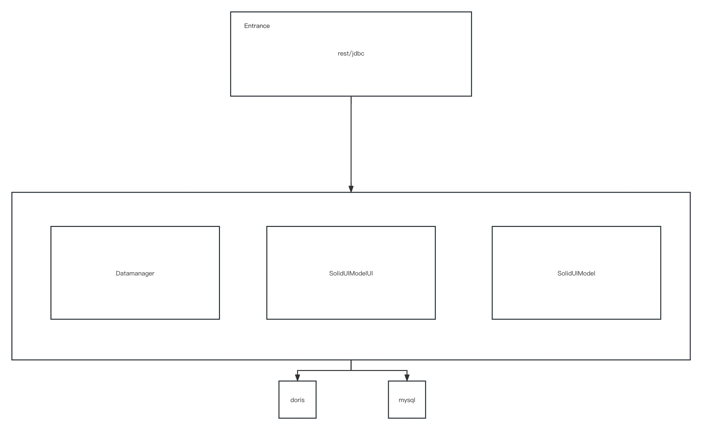

SolidUI服务架构
-------------------------

## 1. 架构总览

Entrance:API接口层，主要负责前端UI层的请求，该服务统一提供RESTful api向外部提供请求服务

## 2.模块功能

* solidui-bom: BOM（Bill of Materials）通常用于管理项目中的依赖版本，以确保所有模块都使用相同版本的依赖。

* solidui-common: 这个模块包含整个项目中使用的通用代码和工具。

* solidui-dao: DAO（Data Access Object）模块包含所有与数据库交互的代码。

* solidui-datasource-plugin: 这个模块提供一种方式来扩展数据源，以便可以从多种不同类型的数据源获取数据。

* solidui-dist: 这个模块负责项目的构建和分发。

* solidui-entrance: 这个模块是项目的主入口点，包含启动和初始化应用程序的代码。

* solidui-service: 这个模块包含业务逻辑代码。

* solidui-spi: SPI（Service Provider Interface）模块提供一种方式来扩展项目的功能。

* solidui-web: 这个模块包含前端代码，用于显示用户界面，聊天界面。

* soliduimodelui: 这个模块模型代理层，用于前端UI层的数据模型转换。

## 3.源码讲解

### 3.1 solidui-bom

这是一个 Maven 的项目对象模型(POM)文件，它是基于 XML 的项目配置文件，用于描述构建项目的信息，如项目依赖、构建插件、项目属性等。

此 POM 文件定义的是一个名为 solidui-bom 的项目，该项目的父项目是 solidui。

在这个 POM 文件中，主要有以下三个部分：

* Properties: 定义了各种依赖库的版本号。这是一种常见的管理项目中所有依赖库版本的方法，可以在一个地方定义和更新所有依赖的版本。

* Parent: 定义了这个项目的父项目。在 Maven 中，可以通过定义父项目来继承一些通用的配置，如依赖管理、插件管理等。

* Dependency Management: 这部分定义了项目的依赖库及其版本。所有在此定义的依赖，都可以在子模块中直接使用而不用指定版本号。如果子模块中的依赖和此处的依赖冲突，那么会优先使用此处定义的版本。

根据这个 POM 文件，你可以知道这个项目依赖了哪些库，以及这些库的版本。此外，如果你需要添加新的依赖库，或者更新现有依赖库的版本，也可以在这个文件中进行。

### 3.2 solidui-common

Constants: 这个类定义了一些全局常量，这些常量在整个项目中可能会用到。例如，HTTP头的键名、加密的密钥等。

DateConstants: 这个类定义了日期时间的格式化字符串常量。

ByteTimeUtils: 这个类当前看起来是空的，可能是一个方便处理字节和时间的工具类。

DESUtil: 这个类提供了基于DES算法的加密和解密方法，用于数据的安全传输。

EncryptionUtils: 这个类提供了一个计算字符串MD5值的方法。

JSONUtils: 这个类提供了一系列的JSON处理方法，包括对象到JSON的序列化、JSON到对象的反序列化、JSON到List或Map的转换等。

LoginUtils: 这个类提供了一些处理登录用户的方法，例如设置登录用户、移除登录用户和获取登录用户。

Utils: 这个类提供了一些通用的工具方法，例如创建一个有自定义线程名和守护状态的线程工厂，创建一个默认的计划任务执行器。

### 3.3 solidui-dao

这个模块名为 solidui-dao，主要包含了与数据访问层相关的配置和对象模型。

SpringConnectionFactory: 这个配置类主要用于配置MyBatisPlus的相关设置，如分页插件、事务管理器、SqlSessionFactory等。

DataSource, DataSourceType, DataSourceTypeKey, JobElement, JobElementPage, JobPage, ModelType, Project, User: 这些类是实体类，代表数据库中的各个表的数据结构。

DataSourceMapper, DataSourceParamKeyMapper, DataSourceTypeMapper, JobElementMapper, JobElementPageMapper, JobPageMapper, ModelTypeMapper, ProjectMapper, UserMapper: 这些接口是MyBatis的Mapper接口，用于定义对应表的CRUD操作。

PageListingResult: 这是一个包装类，用于包装分页查询的结果。

DaoConfiguration: 这是一个Spring的配置类，用于启动Spring Boot的自动配置并扫描Mapper接口。

通过这个模块，你可以方便地进行数据库的操作。例如，你可以通过UserMapper的queryUserByNamePassword方法，查询给定用户名和密码的用户。所有的Mapper接口都继承自MyBatisPlus的BaseMapper接口，所以它们都具备了基础的CRUD操作。

### 3.4 solidui-datasource-plugin

这个模块名为 solidui-datasource-plugin，包含了与数据源插件相关的配置和对象模型。

DorisClient: 这个类继承自BaseJdbcClient，实现了与Doris数据库进行交互的具体方法，包括获取所有数据库、获取数据库的所有表、以及执行查询语句并获取结果。

DorisClientFactory: 这个类继承自BaseJdbcClientFactory，实现了创建DorisClient的工厂方法。

DorisConnectionFactory: 这个类实现了ConnectionFactory接口，提供了创建连接Doris数据库的方法。

MysqlClient: 这个类继承自BaseJdbcClient，实现了与MySQL数据库进行交互的具体方法，包括获取所有数据库、获取数据库的所有表、以及执行查询语句并获取结果。

MysqlClientFactory: 这个类继承自BaseJdbcClientFactory，实现了创建MysqlClient的工厂方法。

MysqlConnectionFactory: 这个类实现了ConnectionFactory接口，提供了创建连接MySQL数据库的方法。

JdbcClientManager: 这个类用于加载配置的ConnectionFactory。

ConnectDTO: 这个类是一个简单的数据传输对象，包含了连接数据库需要的信息，如主机名、端口、用户名、密码、数据库名以及额外参数。

其他接口如JdbcClient、JdbcClientFactory、ConnectionFactory等定义了一些通用的方法，具体的实现类如DorisClient、DorisClientFactory、DorisConnectionFactory等提供了这些方法的具体实现。

此外，这个模块的pom.xml文件配置了solidui-datasource-all子模块，该子模块依赖于solidui-datasource-mysql和solidui-datasource-doris两个模块，这两个模块定义了如何与MySQL和Doris数据库交互。

### 3.5 solidui-dist

这个模块名为 solidui-dist，它主要负责项目的发布和部署。

docker-compose.yml: 这是一个 Docker Compose 配置文件，用于定义和运行多容器的 Docker 应用。在这个文件中，定义了几个服务：solidui-entrance、solidui-web、mysql 和 soliduimodelui。这些服务将会被 Docker 以容器的形式运行。

release-docs: 这个文件夹可能包含了一些发布文档，如 LICENSE 和 NOTICE。

assembly.xml: 这是 Maven Assembly 插件的配置文件，用于定义如何创建项目的发布包。在这个文件中，定义了需要包含哪些文件和文件夹。

这个模块的作用主要是定义如何打包项目和如何部署项目。通过 Docker Compose，可以非常方便地在任何装有 Docker 的机器上部署和运行这个项目。通过 Maven Assembly 插件，可以非常方便地创建项目的发布包，包含了运行项目所需的所有文件。

### 3.6 solidui-entrance

这个模块名为 solidui-entrance，作为应用的入口，提供了多个控制器（Controller）用于处理用户的请求。

BaseController: 提供了一些通用的返回结果的方法，包括成功的结果和错误的结果。

DataSourceController: 提供了一系列与数据源相关的API，如获取所有的数据源类型、根据类型获取参数键、根据数据源名和类型查询数据库等。

JobController: 提供了一些与工作相关的API，如保存页面、更新工作、按项目ID查询工作等。

JobPageController: 提供了一些与工作页面相关的API，如创建工作页面、更新工作页面、按项目ID查询工作页面等。

LoginController: 提供了登录和登出的API。

MetadataQueryController: 提供了一些与元数据查询相关的API，如按数据源名查询数据库、按数据源名查询表、按SQL查询等。

ModelController: 提供了获取模型列表的API。

ProjectController: 提供了一些与项目相关的API，如创建项目、更新项目、按项目名查询项目、删除项目等。

每个Controller都依赖于相应的Service，Service中定义了对应的业务逻辑。例如，DataSourceController依赖于DataSourceService，在DataSourceService中定义了如何查询所有数据源类型、如何根据类型获取参数键等业务逻辑。

此外，还提供了一些Service的实现类，如DataSourceServiceImpl、DataSourceTypeServiceImpl、JobPageServiceImpl、JobServiceImpl、MetadataQueryServiceImpl、ModelServiceImpl、ProjectServiceImpl和UserServiceImpl。这些类实现了对应的Service接口，并提供了具体的业务逻辑。

总的来说，这个模块主要处理用户的请求，执行相应的业务逻辑，并返回结果。

### 3.7 solidui-service

包含了一些服务层的代码。

### 3.8 solidui-spi

ConnectDTO: 这是一个简单的数据传输对象，包含了连接数据库所需的信息。

ConstantsSPI: 这个类定义了一些常量，这些常量在 SPI（服务提供接口）中可能会用到。

### 3.9 solidui-web

这是一个基于React和Ant Design构建的前端项目，项目的主要内容包括：

- 主应用入口`index.tsx`，用于初始化并渲染整个应用。
- `App`组件，是应用的主要组件，用于定义路由和渲染相应的组件。
- `routes`定义了应用的所有路由，包括首页、登录页、项目列表页、数据源列表页、仪表盘页和预览页等。
- `DefaultLayout`组件定义了应用的主要布局，包括头部、侧边栏和主要内容区域。
- `ProjectList`和`DataSourceList`两个组件分别用于展示项目列表和数据源列表。
- `Dashboard`组件用于展示仪表盘，展示数据可视化结果。
- `Login`组件用于处理用户登录逻辑。
- `Home`组件定义了应用的首页内容。
- `useProject`和`useDataSource`两个自定义Hook，用于处理项目和数据源相关的业务逻辑。
- `ModelManager`类，用于管理应用的状态。
- `ViewFactory`类，用于创建视图。
- `SolidView`类，定义了一个抽象的视图基类，所有的视图组件都需要继承这个基类。

此外，项目还包括了一些辅助性的模块，如`ApiService`用于封装API请求，`theme`用于定义主题样式，`solidui-entrance`和`solidui-web`分别是后端和前端的主要模块，`api`和`service`定义了一些API接口和服务，`components`包含了一些公共的组件。

项目使用了一些第三方库，如`axios`用于处理HTTP请求，`lodash-es`用于提供一些实用的工具函数，`antd`是一个基于React的UI组件库，`echarts`用于数据可视化，`react-router-dom`用于处理路由，`react-window`用于优化长列表的渲染性能等。

项目的构建工具是`webpack`，使用了`babel`来转译JavaScript代码，`eslint`和`prettier`用于代码规范和格式化，`jest`用于单元测试。此外，项目还使用了`husky`和`lint-staged`来在提交代码前自动检查和修复代码问题。

### 3.10 soliduimodelui

这是一个基于 Flask 和 MySQL 的后端项目，主要用于处理前端发来的请求并执行相应的操作。主要的功能模块包括：

* kernel_manager：这个模块主要负责管理和操作 Python 内核，处理前端发来的代码执行请求。内核管理器实现了与 Python 内核的通信，接收和处理内核的输出结果，以及处理内核的各种状态。此外，它还提供了一个消息队列用于接收和发送内核的消息。

* kernel_program：这个模块主要负责启动和管理 Python 内核的子进程。它通过子进程的方式启动 Python 内核，然后通过 SnakeMQ 消息队列与内核进行通信。

* utils：这个模块提供了一些实用的工具函数，如发送 JSON 消息、初始化 SnakeMQ 消息队列等。

* webapp：这是一个基于 Flask 的 Web 应用，它提供了一系列的 API 供前端调用，如执行代码、获取执行结果、管理 Python 内核等。这个应用使用了 CORS 中间件来处理跨域请求。

* web_utils：这个模块提供了一些 Web 应用中常用的工具函数，如格式化响应数据、查询数据库等。

* .env：这是一个环境变量配置文件，包含了数据库的连接信息、应用的端口号等配置信息。

项目的运行流程大致如下：

1. 启动 Flask Web 应用，提供 API 接口供前端调用；
2. 前端发起请求，如执行代码等；
3. Web 应用接收请求，调用内核管理器执行相应的操作；
4. 内核管理器通过 SnakeMQ 消息队列与 Python 内核进行通信，执行代码并获取结果；
5. Web 应用将执行结果返回给前端。

此外，项目还提供了一些辅助功能，如日志输出、错误处理等。

