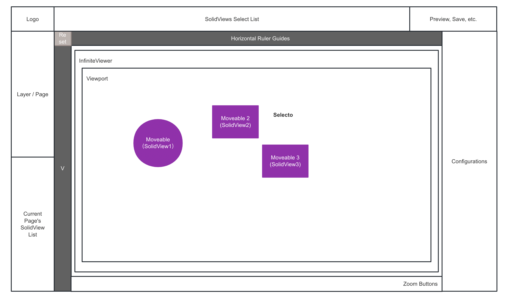
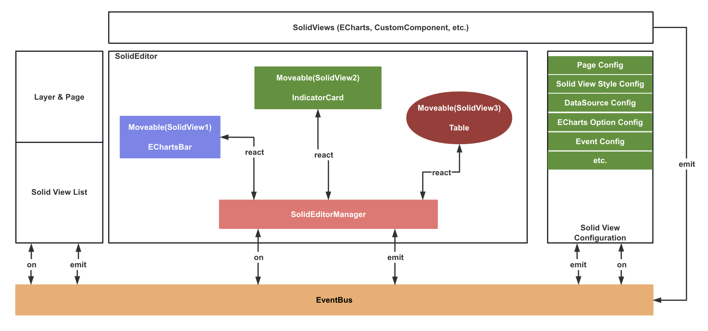
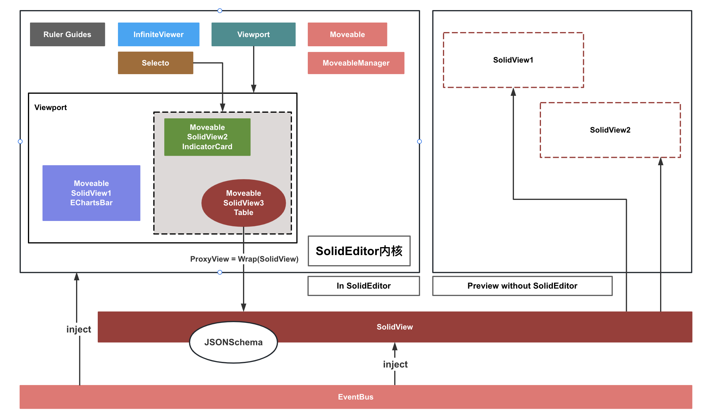
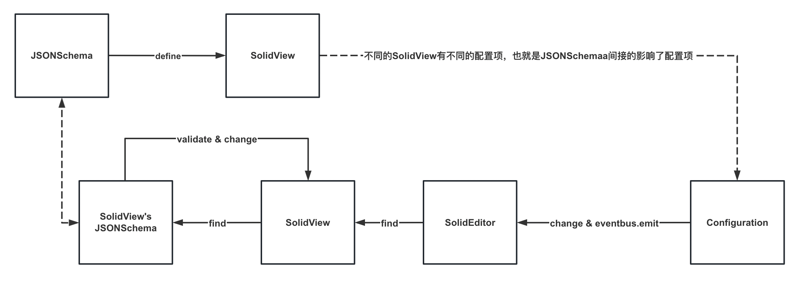

SolidUI前端设计
-------------------------

### 1. 前端UI模块

1. 编辑器整体布局分为五个区域：图层/页面(Layer/Page)，当前设计页面的组件列表区(SolidView List)，SolidEditor编辑区(中间)，组件配置区域(Configuration)，组件选择区域(SolidViews Select List)。

2. 图层/页面(Layer/Page)：图层主要是配置场景，页面UI层是配置设计自己的组件。

3. 组件列表区：方便选择要配置的组件，对组件做删除，锁定等管理操作。

4. SolidEditor编辑区：作为一个高内聚的组件，对外通过 EventBus 来完成事件的订阅、发布。组件内部由 RulerGuides、InfiniteView、Moveable、Selecto、Viewport 来搭配完成整个编辑区域的交互、操作逻辑。

5. 配置区域：对选中的 SolidView 做所见即所得的样式、数据源、事件交互等配置。

6. 组件选择区域：在顶部提供一个选择放置各个组件的按钮区域。

### 2. 总览架构

### 3. SolidEditor & Preview（设计所见即所得）

1. SolidEditor内部集成RulerGuides（标尺、辅助线）、InfiniteView（编辑区无限滚动视图）、Viewport（可见区）、Moveable（拖放、大小、圆角、对齐、标线等基础能力）、Selecto（多选、组合）。
2. SolidView是一个可复用的基类组件，我们希望通过一个设计好的JSONSchema及其具体的JSON内容来展示各种不同的SolidView，即SolidView应该仅仅和JSONSchema的数据模型做绑定，注入EventBus来完成不同SolidView之间的交互。但是当我们在编辑设计的时候，需要对SolidView做包装来达到在设计器模式下具备的设计能力。所以我们需要在编辑模式下对SolidView做一层包装得到一个ProxyView。
3. 当我们预览设计好的页面后，我们的SolidShowEngine会加载设计的JSONSchema具体的数据模型来完成最终的渲染。

### 4. SolidView & JSONSchema & Configuration

1. 设计JSONSchema来定义一个SolidView组件应该有的样子，不同的SolidView组件可能会扩展JSONSchema。这样做的好处是我们把SolidView抽象成一份JSON描述文档，可以聚焦在JSONSchema上，每次修改都是针对JSONSchema来讨论可行性。

2. 在有JSONSchema的基础上，来规划Configuration模块具备的配置能力。包括UI展示，UI需要的组件开发等。

3. 交互流程：选中一个组件 -> 修改配置项 -> 发送修改事件 -> SolidEditor收到订阅的事件消息 -> 找到目标SolidView -> 找到对应的 JSONSchem -> 校验并保存修改 -> SolidView 对本次配置修改做出响应。